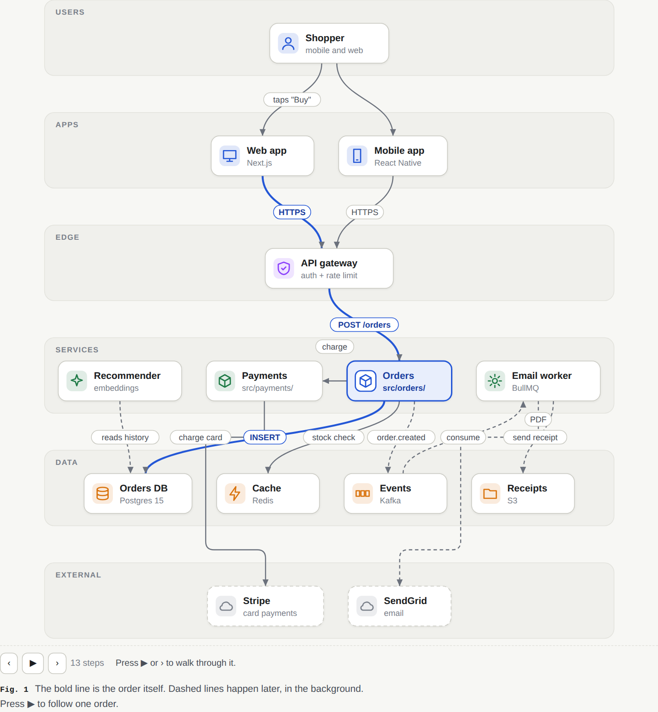

# clearproof

**Clear visuals, proven answers.**

clearproof is a Claude plugin that answers questions with an interactive HTML page instead of a long block of text.
Each page leads with the answer, explains it with diagrams and charts, and shows the evidence behind every claim.


## Features

- **Answer first.** The headline states the answer, followed by a one-line summary.
- **Visual explanations.** Architecture diagrams, step-by-step diagrams, interactive sliders, charts and timelines.
- **Verified content.** Numbers come from calculations that are actually run, code is quoted from the real files,
  sources are linked, and each claim is labelled as checked, inferred or not verified.
- **Code review.** For changes written by an AI agent: the verdict and risks first, each problem reproduced, and a
  count showing that every change was reviewed.
- **Quality checks.** Each page is opened at desktop and phone size and checked for layout problems before it is
  delivered.
- **Single offline file.** Every page is one HTML file that opens in any browser and is easy to share.

## Installation

In Claude Code (terminal, desktop app or IDE extension):

```text
/plugin marketplace add Inspire-Labs-AI/clearproof-html-skill
/plugin install clearproof@clearproof
```

No configuration or API keys are required. Node.js 20 or later must be installed.

## Usage

Ask a question in plain words. Add "make a page" to request a page explicitly; Claude also creates one on its own when
an answer has several connected ideas.

| Use case | Example request |
|---|---|
| Understand a concept | "How do vector databases find similar items so fast?" |
| Learn a topic | "Explain how vaccines train the immune system." |
| Make a decision | "Should I prepay my home loan or invest the money?" |
| Understand a system or codebase | "Explain how this project works." |
| Review AI-written code | "An agent made these changes. Is it safe to ship?" |
| Compare options | "Postgres, MongoDB or DynamoDB for my app?" |
| Get a video walkthrough | "Make a narrated video of that page." |

## Examples

All pages below were created by Claude with clearproof. Download a file and open it in a browser to use the
interactive diagrams.

| Example | Description |
|---|---|
| [Architecture of an online shop](docs/examples/architecture.html) | System tiers, typed components, and a step-through of one order |
| [Garbage collection](docs/examples/garbage-collection.html) | How pauses happen, with a live slider for three collector designs |
| [Home-loan prepayment](docs/examples/home-loan.html) | Savings by prepayment year, with every number calculated |
| [Simplified Technical English](docs/examples/ste100.html) | The aerospace writing standard, with measured before-and-after rewrites |
| [TCP connections](docs/examples/tcp.html) | How a connection opens and closes, message by message |



## How it works

1. **Plan.** Claude decides the main point of the answer and makes it the headline.
2. **Write.** Claude writes a short description of the page: its sections, diagrams and charts. Code is referenced by
   file and line, never retyped.
3. **Build.** clearproof turns the description into a page: it lays out the diagrams, draws the charts, adds the
   interactive controls, and runs the calculations behind each number.
4. **Check.** clearproof opens the page in a browser at desktop and phone width and reports layout problems or
   inconsistent numbers.
5. **Fix.** Claude reviews screenshots of the page, fixes the weakest parts, and returns the file.

Page design, themes and interactive controls are built into clearproof, so Claude only writes the content.

## FAQ

**Is it only for software topics?**
No. It works for technology, science, health, finance and everyday decisions. Code review is one of its uses.

**Where does it work?**
In Claude Code: the terminal, the desktop app and the IDE extensions. Assistants that load skills from a folder can
also use it by copying `skills/clearproof` into their skills directory.

**Can a whole team use it?**
Yes. On Claude Team and Enterprise plans, an admin can enable the plugin for all members in the organization's Claude
Code settings.

**Does it send data anywhere?**
No. Pages are built and checked on your computer.

## Contributing

Bug reports and pull requests are welcome. See [CONTRIBUTING.md](CONTRIBUTING.md).

## License

[MIT](LICENSE) © Inspire Labs AI
