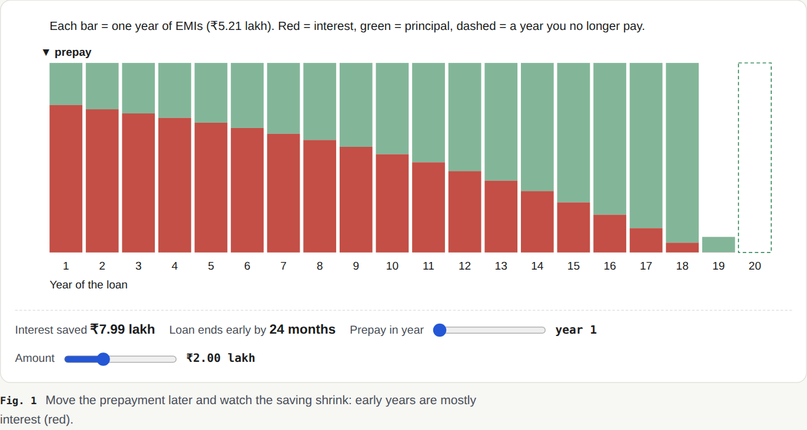
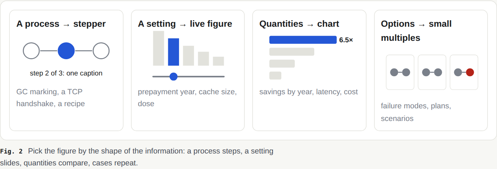

# clearproof

**Clear visuals, proven answers.**

**An agent skill that makes AI output understandable — answers *and* code changes.**

Ask a hard question and get a page with diagrams you can step through, not a wall of text. Ask "what did you change?"
and get a review that leads with the verdict, walks the real diff in the order the data flows, and proves it covered
every hunk. Need it narrated? It exports a video.

## What it makes

Real pages, rendered by clearproof from a short draft the model wrote (open the HTML files in a browser to use the
steppers and sliders).

| Explain: garbage collection ([page](docs/examples/garbage-collection.html)) | Review: an AI-written password reset |
|---|---|
|  |  |
| **Live figure:** drag "live data" and switch collector; the pause length redraws.  | **Proof, not opinion:** each bug is reproduced by running the real code; output is captured at render time.  |

### Not only for code

The method works wherever a reader must **understand and trust** an answer: money, science, health, policy, a
decision. [Home-loan prepayment](docs/examples/home-loan.html) ([draft](examples/home-loan.md)): every number comes
from a [calculator](examples/home-loan/loan.mjs) that clearproof runs while it builds the page, so the page cannot
drift from the math.

|  |  |
|---|---|

### The method

[docs/methodology.html](docs/methodology.html) ([draft](docs/methodology.md)) — itself a clearproof page:

1. **Plan.** The title is the answer, number first. Pick the *hero* figure: the mechanism for "how does X work?",
   the number for "how much / which is better?", the verdict for "should we merge?".
2. **Draw.** 3–6 sections, each one claim plus the figure that proves it, with real values. A process gets a stepper,
   a setting gets a slider, quantities get a highlighted chart, options get small multiples.
3. **Prove.** Point at real code (`src/auth.js:40-52`, hunk `H3`) instead of retyping it; run real commands and show
   the output; cite sources; label models "illustrative"; mark claims verified / inferred / unverified.
4. **Check.** Plain-English lint (ASD-STE100 style), one number per quantity, layout at desktop and phone width.
5. **Critique.** Read each figure's close-up, score Clarity · Visuals · Readability · Trust like a blind judge, fix the
   three weakest.



How we built it, why it beats answer-me-with-html, and why the tests are fair: [docs/how-we-built-clearproof.html](docs/how-we-built-clearproof.html) ([draft](docs/how-we-built-clearproof.md)), made with clearproof.

## How to use it

Install it (below), then just ask in your agent. It triggers on its own for answers with several connected ideas, and
always on "explain visually", "make a page", "review this", "help me understand this change".

```
> Explain how garbage collection pauses work. Make a page.
> Should I prepay my home loan or invest? ₹50 lakh at 8.5%, 20 years. Show me with real numbers.
> An agent wrote this branch. Help me understand it — is it safe to merge?
> Walk me through how auth works in this repo
> Make a 2-minute narrated video of that page
```

The agent plans, writes the draft, renders, reads its own screenshots, fixes what is weak, and gives you the path to
one offline HTML file (in `~/.clearproof/pages/`).

## Why

Two observations, one tool:

- **Andrej Karpathy:** we will spend more and more time *understanding* model output. Move it up a ladder — controlled
  plain English (ASD-STE100), then diagrams, then interactive HTML, then narrated explainer videos.
- **Arpit Bhayani:** human attention is not built for *zero-context scrutiny*, yet that is what reviewing AI-written
  code asks for. Code review should become **code understanding**.

Apply Karpathy's ladder to code and you get Arpit's answer. The full reasoning, and how this improves on
[answer-me-with-html](https://github.com/QingYunA/answer-me-with-html), is in [PLAN.md](PLAN.md).

## How it works

The model writes a short Markdown **draft**. A zero-dependency Node CLI turns it into one offline HTML file: layout,
SVG coordinates, interactivity, light/dark, all computed. The model never writes HTML, CSS or SVG — and **never
retypes code**: it points at `src/auth.js:40-52` or diff hunk `H3`, and clearproof reads the real lines from disk or git.

````markdown
---
title: Review — refresh sessions inside a grace window
tldr: The refresh never reaches the client, so users still get logged out. Do not merge yet.
verdict: changes
---
## The refresh itself — the main problem
```diff H1
+12: The code stores the new session under `randomUUID()` and never returns that token.
+10-17: If `putSession` keeps failing, this loop never ends. There is no attempt limit.
```
````

For these two examples the model wrote 2.7 KB and 4.3 KB of draft. clearproof turned them into 15 KB and 43 KB of page
markup, plus 35 KB of fixed CSS and runtime the model never sees. For measured tokens, time and blind quality scores,
see [BENCHMARK.md](BENCHMARK.md).

## What you get

**Explain mode**

- `figure`: a bespoke interactive figure (HTML/SVG + a small kit: player, steps, before/after, toggle, slider,
  readouts) for the mechanism itself. Everything else is generated from a few lines of draft.
- `run`: execute a command while the page is built and embed its real output, with `shows:` / `expect:` checks.
  `claims`: a verified / inferred / unverified ledger. `cases`: small multiples. `waffle`: a ratio you can feel.
- An editorial layout: the answer as the headline, numbered figure captions, claim headings.
- `flow` diagrams with an automatic layered layout, and `sequence` diagrams — both **play step by step** with a caption
  per step.
- `tree`, `timeline`, `chart` (bar / line, real numbers only), `kv`, `callout`, tables with ✓ ✗ ! badges.
- `glossary`: define a term once, every later use gets a hover definition.
- `quiz`: check-yourself questions with instant feedback. `checklist`: ticks persist in the browser.
- `[[path:line]]` references that preview the real code on hover; `code path:10-40` blocks with margin notes.

**Review mode** (code understanding)

- `clearproof diff` gives the agent hunk ids over committed, uncommitted *and* untracked work.
- `diff H3` blocks show the real hunk with notes pinned to the lines that matter.
- `changemap` shows the shape of the change; `risks` ranks what could break, linked to the code.
- A coverage meter — **"4/4 changes explained"** — and an *All changes* appendix that flags anything the walkthrough
  skipped. Nothing hides in a review.


**For both**

- **Tour:** a narrated walkthrough of the page (tldr → sections → diagram steps), in the browser.
- **Video:** `clearproof video page.html` records the tour to MP4, voiced by ElevenLabs (`ELEVENLABS_API_KEY`), macOS `say`
  or `espeak`, with captions-only as the fallback.
- **Self-check:** `--check` renders the page in headless Chromium at 1280 px and 390 px, reports overflow, overlapping
  labels and runtime errors, and saves a screenshot the agent looks at before answering.
- **Plain-English lint:** a required one-line answer (`tldr`), sentence length, wordy words, passive voice, walls of
  text.
- Errors the agent can fix in one try: `✗ L4 [flow] Arrow is missing a node on one side` plus a correct example.

## Does an agent actually use it well?

We gave SKILL.md, and nothing else, to fresh agents with no context:

- **Explain** ("git merge vs rebase"): 7 sections, 4 diagrams, a glossary and a quiz. One fix round (a passive
  sentence, overlapping groups), then a clean render.
- **Review** (the demo branch above): verdict *block*, **4/4 hunks explained**. It found both bugs in the change and
  one we had not planted: the committed `session.js` imports `refresh.js`, which is untracked, so merging only the
  commits would break startup.

Their friction reports drove fixes in this version: cut-off tables are now detected, warnings quote the sentence they
mean, diff notes and step captions are linted, edge labels no longer sit under nodes, and `check --section` gives a
sharp close-up.

## How does it compare?

Blind, screenshot-judged rounds against [visual-explainer](https://github.com/nicobailon/visual-explainer) (10.2k★),
[answer-me-with-html](https://github.com/QingYunA/answer-me-with-html) and plain "answer in HTML", with the same
model and new tasks each round ([full results and method](BENCHMARK.md)):

| Latest round (4) | clearproof | visual-explainer | plain HTML | answer-me-with-html |
|---|---|---|---|---|
| **Explainers** (score /20, two blind judges) | **18, 18 — avg 18.0** | 18, 17 — avg 17.5 | 13, 15 | 11, 16 |
| **Reviews of AI-written branches** | **1st** | 3rd | 2nd | 4th |
| Time per explainer | 175 s | 379 s | 145 s | 75 s |

**Tokens (round 5, lean mode):** clearproof 0.66 M per explainer vs 0.53 M plain HTML and 0.60 M answer-me-with-html, with
the top blind score (18 and 17 of 20, vs 17 and 12.5 on average). See [BENCHMARK.md](BENCHMARK.md#round-5-tokens-vector-database-explainer).

Across all rounds, **clearproof ranked first in every review judgment** (5/5 on verifiability, completeness and trust:
real hunks with notes, executed proof of each bug, a claim ledger, an "N/N changes explained" index). On explainers it
climbed from 3rd/4th to joint-first after adopting figure-first pages: bespoke interactive figures with a small kit,
an editorial layout, small multiples, and a judge-style critique pass over per-figure close-ups.

## Install

Node.js 20+. Nothing to `npm install`. Video export and `--check` use Playwright and ffmpeg if they are present.

**Claude Code plugin**

```
/plugin marketplace add Inspire-Labs-AI/html-skill
/plugin install clearproof@clearproof
```

**Any agent with skills** (Claude Code, Codex, Cursor, OpenCode, …): copy `skills/clearproof` into the agent's skill folder,
e.g. `cp -R skills/clearproof ~/.claude/skills/clearproof`.

## Use the CLI directly

```bash
L=skills/clearproof/scripts/clearproof.mjs
node $L render examples/tcp.md --check          # page + layout check + screenshot
node $L render examples/home-loan.md --check --allow-run   # runs the loan calculator for its numbers
node $L diff                                    # hunk index of the current change
node $L render review.md --check                # run inside the repository under review
node $L video ~/.clearproof/pages/page.html          # narrated MP4 of the page's tour
node $L help flow                               # syntax for one component; `node $L list` for all
```

Try the review example yourself:

```bash
examples/make-review-demo.sh /tmp/clearproof-demo && cd /tmp/clearproof-demo
node "$OLDPWD/skills/clearproof/scripts/clearproof.mjs" render "$OLDPWD/examples/review-token-refresh.md" --check
```

Pages go to `~/.clearproof/pages/` (set `CLEARPROOF_HOME` to move them, `-o` for one file). Code links use
`vscode://file/{abs}:{line}`; set `CLEARPROOF_LINK` (tokens `{abs}`, `{path}`, `{line}`) for another editor.

## Develop

```bash
npm test     # node --test, no dependencies
```

Source: `skills/clearproof/scripts/` — `lib/parse.mjs` (draft), `lib/layout.mjs` (graph layout), `lib/components/`,
`lib/git.mjs` (diff + hunk ids), `lib/repo.mjs` (code references), `lib/lint.mjs`, `lib/check.mjs`, `lib/video.mjs`,
`assets/` (CSS + browser runtime).
