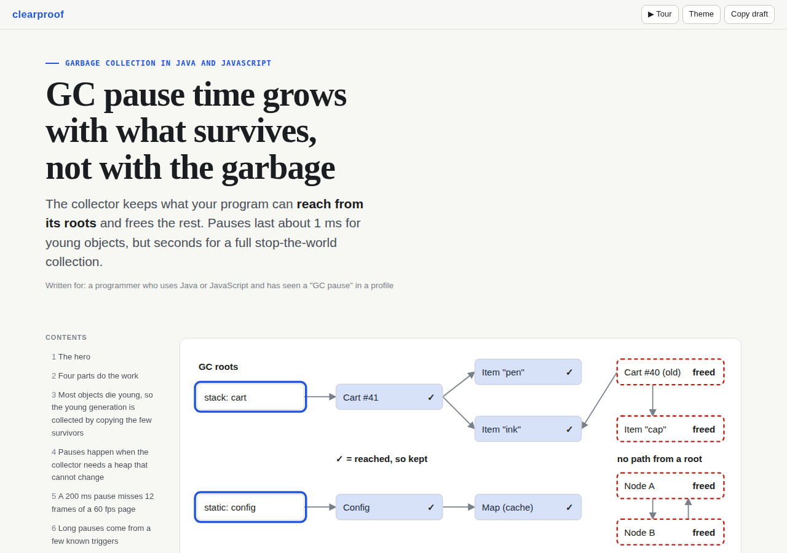
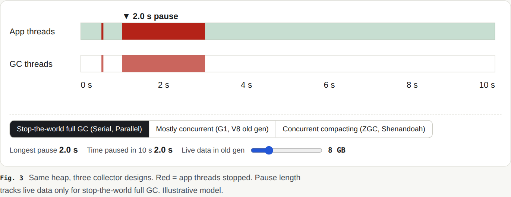
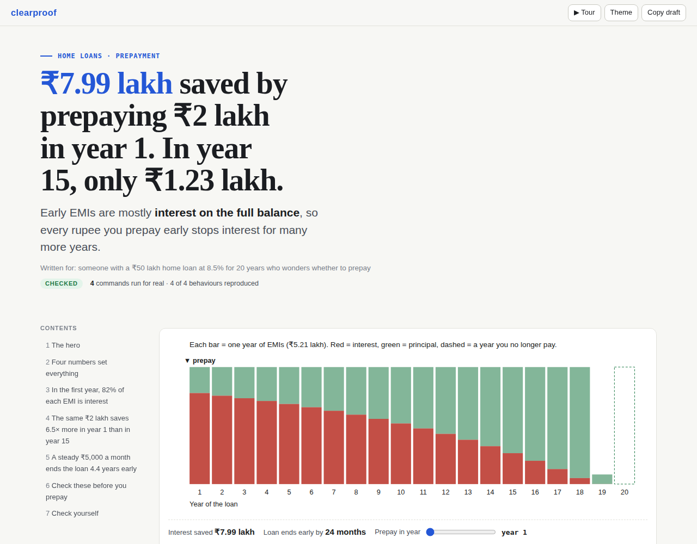
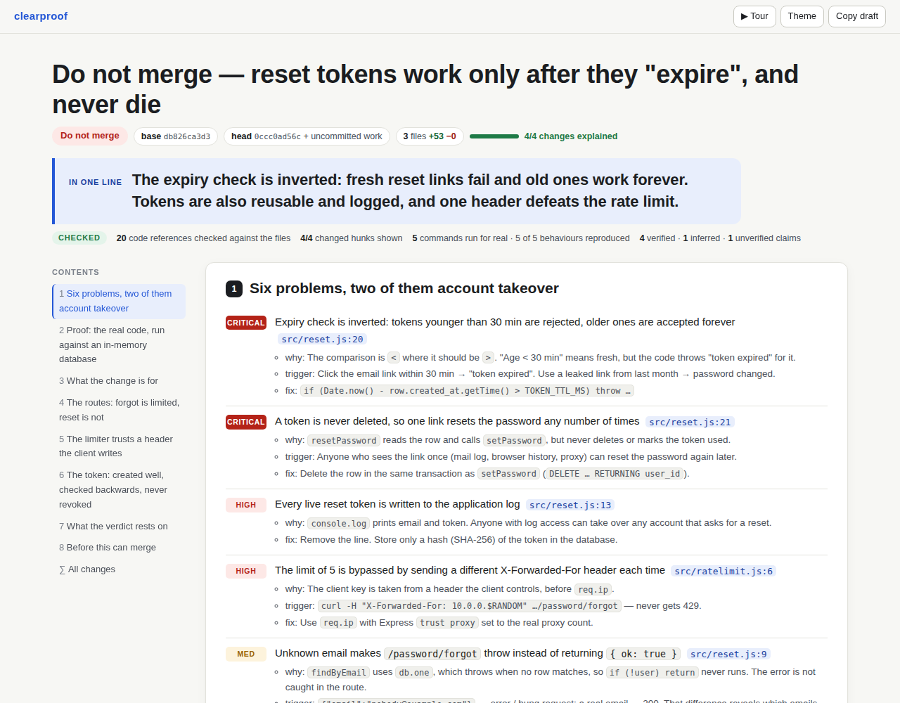
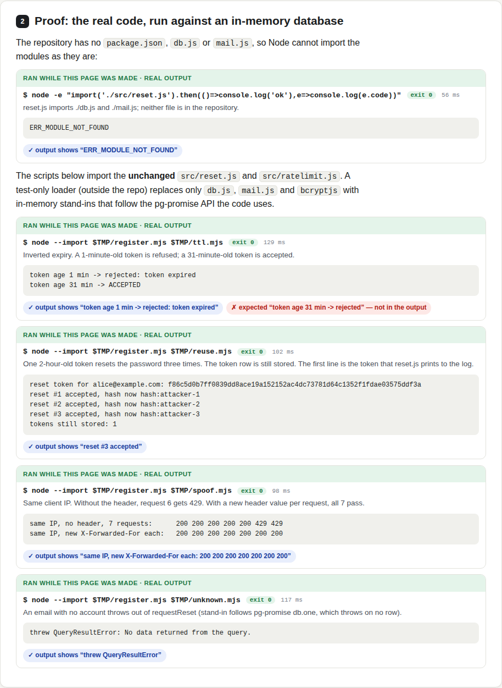

<div align="center">

# clearproof

### Clear visuals, proven answers

**Ask Claude anything — a tech concept, a topic you are learning, a money decision, code an AI wrote — and get one
interactive page you understand in minutes and can trust: diagrams you step through, charts from real numbers, and
proof for every claim.**

[](https://github.com/Inspire-Labs-AI/html-skill/actions/workflows/ci.yml)
[](LICENSE)


[Get started](#get-started) · [What you can ask](#what-you-can-ask) · [Examples](#examples) ·
[How it works](#how-it-works) · [Results](#results) · [FAQ](#faq)



</div>

---

AI answers are getting longer, and reading them is now the slow part. A wall of text hides the one idea that matters,
and you cannot tell which sentences are checked and which are guessed.

**clearproof** is a plugin for Claude that answers with a page instead of a wall of text:

- **The answer comes first.** The headline states the answer, with the key number. One short summary follows.
- **Pictures carry the explanation.** Diagrams play step by step, sliders let you feel a trade-off, and charts compare
  real numbers.
- **Every claim shows its proof.** Numbers come from calculations Claude actually runs, code is quoted from the real
  files, sources are linked, and each claim is marked *checked*, *inferred* or *not verified*.
- **One file, yours to keep.** The page opens in any browser, works offline, and is easy to share.

## Get started

**In Claude Code** (terminal, desktop app or IDE), run these two commands once:

```text
/plugin marketplace add Inspire-Labs-AI/html-skill
/plugin install clearproof@clearproof
```

That is the whole setup: no configuration and no API keys. Your computer needs Node.js 20 or later, which most
machines with Claude Code already have.

Then ask in plain words, and add "make a page" if you want one every time. Claude also makes a page on its own when an
answer has several connected ideas.

## What you can ask

| You want to… | Ask, for example | You get |
|---|---|---|
| **Understand a tech concept** | "How do vector databases find similar items so fast?" | The mechanism, drawn and stepped through, with real numbers |
| **Learn any topic** | "Explain how vaccines train the immune system." | Short steps, a picture per idea, and a quiz that checks you got it |
| **Make a decision** | "Should I prepay my home loan or invest? ₹50 lakh at 8.5% for 20 years." | A slider for the choice, and every number calculated, not guessed |
| **Understand a codebase** | "Explain how this project works." | An architecture diagram and the real code behind each part |
| **Check code an AI wrote** | "An agent made these changes. Is it safe to ship?" | The verdict first, each problem shown happening, and proof that every change was reviewed |
| **Compare options** | "Postgres vs MongoDB vs DynamoDB for my app?" | A side-by-side view of what changes between them |
| **Watch instead of read** | "Make a narrated video of that page." | A video walkthrough of the page |

## Examples

Every page below was made by Claude with clearproof. Download an HTML file and open it in a browser to step through the
diagrams and drag the sliders.

| | |
|---|---|
| **Tech: garbage collection** · [page](docs/examples/garbage-collection.html)<br>Drag the slider and the pause time redraws for three designs.<br> | **Money: home-loan prepayment** · [page](docs/examples/home-loan.html)<br>Every number comes from a real loan calculation.<br> |
| **Code review: changes an AI wrote**<br>The verdict, the ranked risks, and "4/4 changes explained".<br> | **Proof, not opinion**<br>Each problem is shown happening, with the real output.<br> |

More pages:

- [Simplified Technical English, explained](docs/examples/ste100.html): the aerospace writing standard Andrej Karpathy
  suggested for reading AI answers, with measured before-and-after rewrites.
- [How internet connections open and close (TCP)](docs/examples/tcp.html): diagrams that play message by message.
- [The clearproof method](docs/methodology.html) and [how we built clearproof](docs/how-we-built-clearproof.html), both
  made with clearproof.

## How it works

You ask a question. Behind the scenes, five things happen:

1. **Plan.** Claude decides the one sentence you must leave with and makes it the headline. For a code review, the
   headline is the verdict: ship it, fix it first, or stop.
2. **Write.** Claude writes a short description of the page: the sections, the diagrams, the charts. It never retypes
   code; it points at the real lines, and clearproof copies them from your files.
3. **Build.** clearproof turns that description into one page: it lays out the diagrams, draws the charts, adds the
   controls, and runs the small calculations that prove each number.
4. **Check.** clearproof opens the page at laptop and phone size and reports anything broken: overlapping labels,
   cut-off tables, text too small to read, or one number written two different ways.
5. **Fix.** Claude looks at pictures of its own page, fixes the weakest parts, and gives you the file.

The design, the light and dark themes, the guided tour and the step-through controls are built into clearproof, so
Claude spends its effort on the content, not on styling. A page costs about as much as asking for a plain HTML answer.

## What is on every page

- **A headline that answers the question**, then a one-line summary and a contents list.
- **Figures that show how things work:** step-by-step diagrams, interactive sliders and toggles, charts with the
  important bar highlighted, side-by-side comparisons, timelines.
- **A "Checked" strip** that says what was verified: calculations run, code quoted, claims labelled.
- **Plain English:** short sentences and common words, following the ideas of Simplified Technical English.
- **Checks on your understanding:** quizzes that explain every answer, and terms you can hover for a definition.
- **For code reviews:** the verdict and risks first, each problem shown happening, notes beside the exact lines, and a
  count that proves every change was reviewed.
- **A guided tour** that walks through the page, and a **video** version on request.

## Results

We compared clearproof with a plain "answer me with an HTML page" request and with other popular skills. Fresh Claude
sessions answered the same question each way. Separate judges saw only screenshots, with the names hidden, and
answered fixed questions about the topic. The topic changed every round.
[Full method and every round](docs/benchmark.md).

| Latest round: "How does a vector database find similar items fast?" | clearproof | Plain HTML | answer-me-with-html |
|---|---|---|---|
| Judges' score, out of 20 (two runs) | **18, 17** | 17, 17 | 14, 11 |
| Cost per page (tokens) | 0.66 M | 0.53 M | 0.60 M |
| Time per page | 4.1 min | 2.8 min | 1.1 min |

For code reviews, clearproof **ranked first in every round**. It was the only approach where judges could check every
finding against evidence on the page and confirm that nothing was skipped.

*Limits:* the judges were AI models, not people, and they scored still screenshots, so sliders, diagrams that play
and videos were not part of the score.

## How it compares

| | clearproof | answer-me-with-html | visual-explainer | Plain HTML answer |
|---|---|---|---|---|
| Answer as the headline, pictures first | ✅ | partial | ✅ | varies |
| Diagrams you step through, sliders | ✅ | ❌ | ✅ | varies |
| Numbers calculated, not guessed | ✅ | ❌ | ❌ | ❌ |
| Code quoted from the real files | ✅ | ❌ | ❌ | ❌ |
| Code review that proves every change was covered | ✅ | ❌ | partial | ❌ |
| Page checked in a browser before you see it | ✅ | ❌ | ❌ | ❌ |
| Narrated video | ✅ | ❌ | ❌ | ❌ |

## FAQ

**What is clearproof?**
A free, open-source plugin for Claude that turns answers into interactive pages you understand fast and can verify.

**Is it only for programmers?**
No. It explains tech, science, health, history, money and everyday decisions. Code review is one of the things it
does well, not the only one.

**Where does it work?**
In Claude Code: the terminal, the desktop app and the IDE extensions. It also works in other assistants that support
skills, such as Codex and Cursor: copy the `skills/clearproof` folder into the assistant's skills folder. We have not
yet tested uploading it to the Claude web app, because building a page needs Node.js.

**Can my whole team get it?**
Yes. On Claude Team and Enterprise, an admin can add this plugin in the organization's Claude Code settings so that
every member has it. Anyone can also run the two install commands above.

**Do I need to configure anything?**
No. Install the plugin and ask.

**Does it send my data anywhere?**
No. Pages are built and checked on your computer, and each page is a single offline file.

**How is it different from asking Claude for an HTML page?**
A plain request gives a page that looks good but checks nothing. clearproof calculates its numbers, quotes real code,
labels what it verified, and checks the page before you see it. In blind tests it also scored higher.

**What is Simplified Technical English?**
The controlled English that aircraft maintenance manuals use: short sentences, one meaning per word, no vague words.
Andrej Karpathy suggested it for reading AI answers. clearproof writes in that style. [Read the explainer](docs/examples/ste100.html).

## Why we built it

Andrej Karpathy argued that we will spend more and more time *understanding* what AI produces, and suggested a ladder:
plain controlled English, then diagrams, then interactive pages, then narrated videos. Arpit Bhayani pointed out that
reviewing AI-written code asks people for "zero-context scrutiny", which human attention is not built for. clearproof
puts both ideas into one tool. More in [docs/design.md](docs/design.md).

Thanks to [answer-me-with-html](https://github.com/QingYunA/answer-me-with-html) for the idea that the model should
write a short description and a tool should build the page, and to
[visual-explainer](https://github.com/nicobailon/visual-explainer) for raising the bar on figures.

## Contributing

Ideas, bug reports and pull requests are welcome. See [CONTRIBUTING.md](CONTRIBUTING.md).

## License

[MIT](LICENSE) © Inspire Labs AI
